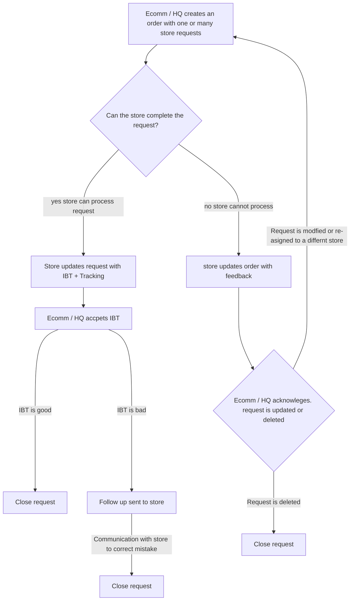

# paddy-mern-4
This is attempt number 4 for creating this app. It was a lot harder than what I thought it would be!

## Project Description
This app will serve as a task coordination tool an ecommerce department within a retail company. This app will communicate tasks and allow information to be passed back regarding specific tasks.

## Problem
Problem I'm trying to solve was that at my old workplace several google sheets were used to coordinate task deligation and information flow between an ecommerce center and 7 retail locations. 

## MVP (Minimum viable product)
1. Ecomm / HQ user is able to create tasks
2. Store users are able to action tasks and update tasks (update with yes okay task complete, or not able to complete)
3. Ecomm / HQ user can either reasign task, close or delete task.  

There will be 1 HQ user that creates and delegates tasks. 8 locations that can be assiged a task. 

### Basic functionality of the app:

## My goals and motivations
My goal is to create a webapp to replace the several sheets- allow for a single store of data and different views depending on login location. Apply my front end knowledge and learn about backend development. 
Secondary goal is to become familiar with the MERN stack, and get some experience in full stack development. 

## Challenges
I feel a little overwhelmed with all the different pieces, and trying to iron out the details how exactly the app should work.
I've become more comfortable with the idea of creating something barely functional and using bad practices to have a finished product that I can iterate over. 
